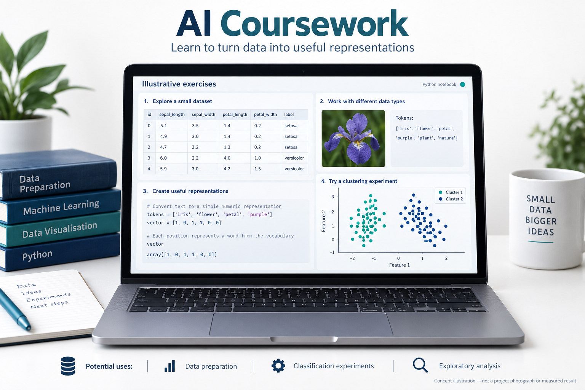
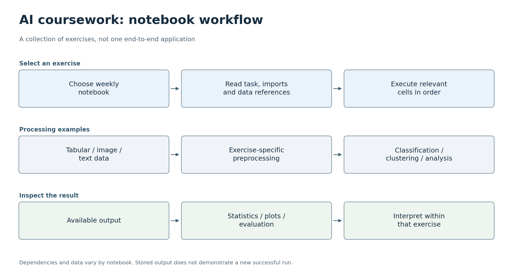

# AI·데이터 분석 실습

[한국어](#korean) · [English](#english)

## 한국어

이 저장소에는 Sangheon Park가 AI 입문 수업에서 작성한 주차별 노트북이 담겨 있습니다. 각 노트북에는 실습 과제, 코드, 수업 당시 저장한 출력이 포함되어 있습니다. 일부 셀과 함께 사용하는 파일은 수업 자료로 제공되었습니다.

루트의 노트북은 주차별로 정리되어 있으며, [2주차](21800275_SangheonPark_Week2.ipynb), [6주차](21800275_SangheonPark_Week6.ipynb), [11주차](21800275_SangheonPark_Week11.ipynb), [13주차](21800275_SangheonPark_Week13.ipynb) 등이 있습니다. [Exercise](Exercise) 디렉터리에는 함께 제공되는 버전이 있으며, 루트 파일과 내용이 겹칠 수 있습니다.

13주차 노트북은 2026년 9월 28일 로컬 수업 과제 사본에서 가져와 추가했습니다. 저장된 출력과 실행 횟수 표시는 지웠으며, 코드는 다시 실행하지 않았습니다.

### 프로젝트 목표

각각의 노트북 실습을 통해 전처리, 특징, 모델이 원시 데이터를 해석 가능한 분석 결과로 바꾸는 과정을 배웁니다.

AI로 생성한 콘셉트 일러스트입니다. 기기의 외형, 인터페이스 배치, 예시 그래픽은 설명을 위한 표현이며, 실제 프로젝트 사진이나 측정 결과가 아닙니다.

### 활용할 수 있는 곳

이 실습들은 데이터 준비, 분류, 군집화의 초기 실험에 활용할 수 있습니다. 작은 데이터셋을 살펴보고, 기준이 될 방법을 선택한 뒤, 더 큰 애플리케이션을 만들기 전에 출력을 확인하는 데 도움이 됩니다. 주된 용도는 분석 작업 흐름을 배우고 시험하는 것입니다. 새로운 데이터셋에 사용할 모델에는 별도의 학습과 평가가 필요하며, 이 노트북들이 곧바로 배포할 수 있는 범용 시스템을 입증하는 것은 아닙니다.

### 한눈에 보기

각 행은 서로 독립적인 실습이나 작업 흐름을 설명합니다. 이 저장소 전체가 하나로 연결된 애플리케이션은 아닙니다. [SVG](docs/flowcharts/ai.svg)

### 노트북 읽는 방법

이 노트북들은 하나의 진입점으로 실행하는 단일 애플리케이션이 아니라 수업 과제 기록입니다. 한 주차의 노트북을 열어 과제와 가져오는 라이브러리를 읽고, 원래 순서대로 셀을 따라가면 됩니다. 앞선 셀에서 만든 변수가 뒤에서 필요할 수 있으므로, 맥락 없이 복사한 셀은 단독으로 실행되지 않을 수 있습니다. `Exercise`의 사본은 파일명이 겹친다는 이유만으로 별도 프로젝트로 세어서는 안 됩니다.

[13주차](21800275_SangheonPark_Week13.ipynb)에는 scikit-learn과 NLTK를 사용하는 텍스트 처리 및 분류 코드가 있습니다. 분류기를 적용하기 전에 텍스트를 어떻게 특징으로 바꾸는지 살펴볼 수 있는, 비교적 최근에 추가된 출발점입니다. 전체 실행을 시도하기 전에 참조하는 파일과 가져오는 라이브러리를 확인해야 합니다. 노트북이 있다는 사실만으로 모든 외부 데이터셋이나 언어 리소스가 포함되어 있다고 보장할 수는 없습니다.

### 사본 실행하기

Jupyter와 호환되는 환경을 사용하고, 먼저 선택한 노트북이 가져오는 라이브러리와 데이터 경로를 확인하세요. 해당 노트북에 필요한 패키지를 설치하고, 새 커널을 시작한 뒤, 셀을 순서대로 실행하면 됩니다. 저장소 전체에 대해 검증된 환경 잠금 파일이나 모든 주차를 한 번에 검사하는 단일 명령은 없습니다.

저장된 셀 출력은 수업 실습이 무엇을 했는지 이해하는 데 도움이 되지만, 이를 생성한 코드나 환경이 바뀐 뒤에도 남아 있을 수 있습니다. 13주차는 의도적으로 저장된 출력을 포함하지 않으므로, 이 추가분에 대해 새로 재현한 점수를 보고할 수는 없습니다. 이 아카이브는 제출한 수업 과제, 제공받은 실습 자료, 이후의 포트폴리오 유지보수 작업을 구분합니다.

노트북은 GitHub에서 바로 읽을 수 있습니다. 2026년 9월 28일에 버전 4 노트북 구조를 확인했지만, 셀은 다시 실행하지 않았습니다. 저장된 출력은 원래 환경의 결과이며, 새로 재현한 결과로 간주해서는 안 됩니다.

[원본 저장소](https://github.com/oldprize47/Introduction_AI). 원래 이력과 저작자 표기를 유지합니다.

---

## English

**AI and Data Analysis Labs**

This repository holds weekly notebooks by Sangheon Park from an introductory AI course. Each notebook contains the exercise, code and any output saved during the course. Some cells and companion files were provided as teaching material.

The root notebooks are organised by week, including [Week 2](21800275_SangheonPark_Week2.ipynb), [Week 6](21800275_SangheonPark_Week6.ipynb) [Week 11](21800275_SangheonPark_Week11.ipynb) and [Week 13](21800275_SangheonPark_Week13.ipynb). The [Exercise](Exercise) directory contains companion versions, which may overlap with the root files.

Week 13 was added from the local coursework copy on 28 September 2026. Its stored outputs and execution counters were cleared; its code has not been rerun.

### Project goal

Learn how preprocessing, features and models turn raw data into interpretable analysis through separate notebook exercises.

AI-generated concept illustration. Device appearance, interface layout and example graphics are illustrative, not project photographs or measured results.

### Where it could be used

These exercises can support early experiments with data preparation, classification and clustering: inspect a small dataset, choose a baseline method and examine its output before building a larger application. Their main use is learning and testing an analysis workflow. A model for a new dataset would need its own training and evaluation; the notebooks do not establish a ready-to-deploy general-purpose system.

### At a glance

Each row describes an independent exercise or workflow; the repository is not one connected application. [SVG](docs/flowcharts/ai.svg)

### How to read the notebooks

The notebooks are coursework records rather than a single application with one entry point. Open a week, read the exercise and imports, then follow the cells in their original order. Variables created in an earlier cell may be required later, so a cell copied out of context may not run by itself. The `Exercise` copies should not be counted as separate projects simply because the filenames overlap.

[Week 13](21800275_SangheonPark_Week13.ipynb) includes text-processing and classification code using scikit-learn and NLTK. It is a useful recent entry point for seeing how text is turned into features before a classifier is applied. Check its file references and library imports before attempting a full run; the presence of a notebook does not guarantee that every external dataset or language resource is included.

### Running your own copy

Use a Jupyter-compatible environment and inspect the selected notebook's imports and data paths first. Install the packages required by that notebook, start a clean kernel and execute the cells in order. There is no validated repository-wide environment lock or one-command test for every week.

Saved cell output can help explain what a course exercise did, but it can outlive the code or environment that produced it. Week 13 intentionally has no stored output, so there are no newly reproduced scores to report for that addition. The archive distinguishes coursework submissions, supplied exercise material and later portfolio maintenance.

You can read the notebooks directly on GitHub. Their version-4 notebook structure was checked on 28 September 2026, but the cells were not rerun. Saved outputs reflect the original environment and should not be treated as newly reproduced results.

[Original repository](https://github.com/oldprize47/Introduction_AI). Original history and attribution are retained.
