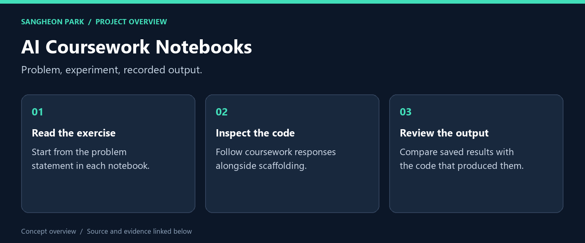
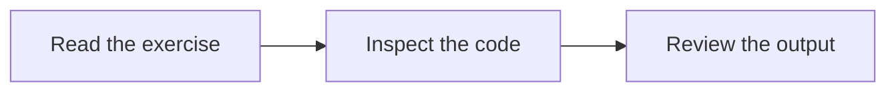

# AI Coursework Notebooks

**Weekly AI notebooks showing the progression from exercise statements to code and saved experimental output.**

[What I built](#what-i-built) · [My role](#my-role) · [Code and reproduction](#code-and-reproduction) · [Portfolio](https://github.com/oldprize47-SH)

## What I built

| Deliverable | What it does | Explore |
|---|---|---|
| **Early coursework** | Start with a short weekly notebook | [Source / result](21800275_SangheonPark_Week2.ipynb) |
| **Mid-course work** | Follow a later exercise | [Source / result](21800275_SangheonPark_Week6.ipynb) |
| **Later coursework** | Inspect code and saved outputs together | [Source / result](21800275_SangheonPark_Week11.ipynb) |

### Result at a glance

Notebook JSON was validated; cells were not rerun. Saved outputs are historical.

## My role

The notebooks mix exercise scaffolding with coursework responses. Inspect each notebook to distinguish the original prompt, supplied material and completed work.

## How it works

The diagram is a reading route through separate exercises, not one integrated runtime.

## Code and reproduction

## Reading the archive

GitHub can display the saved notebooks. Start with one weekly notebook and read
its problem statement, code and stored output together. Root and `Exercise/`
versions may overlap; this pass preserves them rather than silently deleting one.

All notebook files in this source repository were checked as readable version-4
notebook JSON on 2026-09-28. Cells were **not re-executed**, and stored outputs are
historical. That check does not establish model accuracy or reproducible environments.

## Source and credits

[Original repository](https://github.com/oldprize47/Introduction_AI) · [Portfolio home](https://github.com/oldprize47-SH)

Course scaffolding, team contributions and third-party assets retain their original attribution. This documentation does not grant a new licence.
