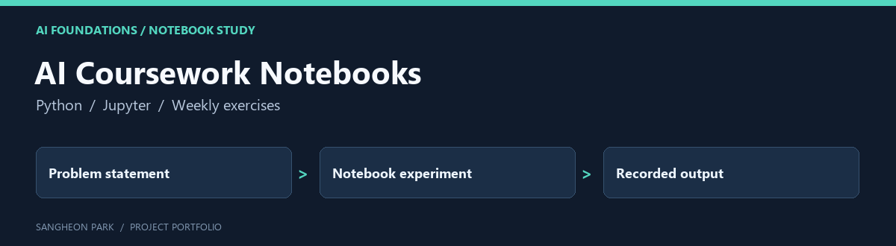

# AI Coursework Notebooks

A week-by-week notebook archive from introductory AI coursework, retained as supporting evidence of study rather than a single deployable application.

[Portfolio home](https://github.com/oldprize47-SH) · [Original repository](https://github.com/oldprize47/Introduction_AI)

## Contribution and context

The notebooks mix exercise scaffolding with coursework responses. Inspect each notebook to distinguish the original prompt, supplied material and completed work.

## Code map

| Entry | Purpose |
|---|---|
| [21800275_SangheonPark_Week2.ipynb](21800275_SangheonPark_Week2.ipynb) | Early weekly exercise |
| [21800275_SangheonPark_Week6.ipynb](21800275_SangheonPark_Week6.ipynb) | Mid-course exercise |
| [21800275_SangheonPark_Week11.ipynb](21800275_SangheonPark_Week11.ipynb) | Later weekly exercise |
| [Exercise](Exercise) | Companion exercise versions |

## Reading the archive

GitHub can display the saved notebooks. Start with one weekly notebook and read
its problem statement, code and stored output together. Root and `Exercise/`
versions may overlap; this pass preserves them rather than silently deleting one.

All notebook files in this source repository were checked as readable version-4
notebook JSON on 2026-09-28. Cells were **not re-executed**, and stored outputs are
historical. That check does not establish model accuracy or reproducible environments.

## Archive policy

The fork retains upstream history, source attributions and course material. The
portfolio documentation does not assign a new licence or claim sole authorship
of inherited code. Current checks are stated above; an untested component is not
presented as verified.
